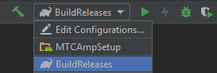

# Files
- [MTCAmpSetup](https://www.sendspace.com/file/u6ai32) - refactored from Android 6
- [MTCAmpSetup](https://www.sendspace.com/file/z1i71u) - original MOD & ROOT
- [MTCAmpSetup MOD & ROOT](../MTCAmpSetup) **current version of** MOD & ROOT
  
## What you must know yet?
To build MTCAmpSetup MOD and ROOT at the same time use:  
  
(apk will be built in folder Output)